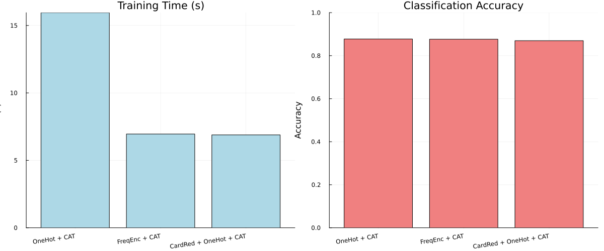

```@meta
EditURL = "notebook.jl"
```

# Adult Income Prediction: Comparing Categorical Encoders

**Julia version** is assumed to be 1.10.*

This demonstration is available as a Jupyter notebook or julia script (as well as the dataset)
[here](https://github.com/essamwise/MLJTransforms.jl/tree/main/docs/src/tutorials/wine_example).

This tutorial compares different categorical encoding approaches on adult income prediction.
We'll test OneHot, Frequency, and Cardinality Reduction encoders with CatBoost classification.

**Why compare encoders?** Categorical variables with many levels (like occupation, education)
can create high-dimensional sparse features. Different encoding strategies handle this
challenge differently, affecting both model performance and training speed.

**High Cardinality Challenge:** We've added a synthetic feature with 100 categories to
demonstrate how encoders handle extreme cardinality - a common real-world scenario with
features like customer IDs, product codes, or geographical subdivisions.

packages are already activated by generate.jl

````julia
using MLJ, MLJTransforms, DataFrames, ScientificTypes
using Random, CSV, StatsBase, Plots, BenchmarkTools
````

Import scitypes from MLJ to avoid any package version skew

````julia
using MLJ: OrderedFactor, Continuous, Multiclass
````

## Load and Prepare Data
Load the Adult Income dataset. This dataset contains demographic information
and the task is to predict whether a person makes over $50K per year.

Load data with header and rename columns to the expected symbols

````julia
df = CSV.read("./adult.csv", DataFrame; header = true)
rename!(
    df,
    [
        :age,
        :workclass,
        :fnlwgt,
        :education,
        :education_num,
        :marital_status,
        :occupation,
        :relationship,
        :race,
        :sex,
        :capital_gain,
        :capital_loss,
        :hours_per_week,
        :native_country,
        :income,
    ],
)

first(df, 5)
````

```@raw html
<div><div style = "float: left;"><span>5×15 DataFrame</span></div><div style = "clear: both;"></div></div><div class = "data-frame" style = "overflow-x: scroll;"><table class = "data-frame" style = "margin-bottom: 6px;"><thead><tr class = "header"><th class = "rowNumber" style = "font-weight: bold; text-align: right;">Row</th><th style = "text-align: left;">age</th><th style = "text-align: left;">workclass</th><th style = "text-align: left;">fnlwgt</th><th style = "text-align: left;">education</th><th style = "text-align: left;">education_num</th><th style = "text-align: left;">marital_status</th><th style = "text-align: left;">occupation</th><th style = "text-align: left;">relationship</th><th style = "text-align: left;">race</th><th style = "text-align: left;">sex</th><th style = "text-align: left;">capital_gain</th><th style = "text-align: left;">capital_loss</th><th style = "text-align: left;">hours_per_week</th><th style = "text-align: left;">native_country</th><th style = "text-align: left;">income</th></tr><tr class = "subheader headerLastRow"><th class = "rowNumber" style = "font-weight: bold; text-align: right;"></th><th title = "Int64" style = "text-align: left;">Int64</th><th title = "InlineStrings.String31" style = "text-align: left;">String31</th><th title = "Int64" style = "text-align: left;">Int64</th><th title = "InlineStrings.String15" style = "text-align: left;">String15</th><th title = "Int64" style = "text-align: left;">Int64</th><th title = "InlineStrings.String31" style = "text-align: left;">String31</th><th title = "InlineStrings.String31" style = "text-align: left;">String31</th><th title = "InlineStrings.String15" style = "text-align: left;">String15</th><th title = "InlineStrings.String31" style = "text-align: left;">String31</th><th title = "InlineStrings.String7" style = "text-align: left;">String7</th><th title = "Int64" style = "text-align: left;">Int64</th><th title = "Int64" style = "text-align: left;">Int64</th><th title = "Int64" style = "text-align: left;">Int64</th><th title = "InlineStrings.String31" style = "text-align: left;">String31</th><th title = "InlineStrings.String7" style = "text-align: left;">String7</th></tr></thead><tbody><tr><td class = "rowNumber" style = "font-weight: bold; text-align: right;">1</td><td style = "text-align: right;">25</td><td style = "text-align: left;">Private</td><td style = "text-align: right;">226802</td><td style = "text-align: left;">11th</td><td style = "text-align: right;">7</td><td style = "text-align: left;">Never-married</td><td style = "text-align: left;">Machine-op-inspct</td><td style = "text-align: left;">Own-child</td><td style = "text-align: left;">Black</td><td style = "text-align: left;">Male</td><td style = "text-align: right;">0</td><td style = "text-align: right;">0</td><td style = "text-align: right;">40</td><td style = "text-align: left;">United-States</td><td style = "text-align: left;">&lt;=50K</td></tr><tr><td class = "rowNumber" style = "font-weight: bold; text-align: right;">2</td><td style = "text-align: right;">38</td><td style = "text-align: left;">Private</td><td style = "text-align: right;">89814</td><td style = "text-align: left;">HS-grad</td><td style = "text-align: right;">9</td><td style = "text-align: left;">Married-civ-spouse</td><td style = "text-align: left;">Farming-fishing</td><td style = "text-align: left;">Husband</td><td style = "text-align: left;">White</td><td style = "text-align: left;">Male</td><td style = "text-align: right;">0</td><td style = "text-align: right;">0</td><td style = "text-align: right;">50</td><td style = "text-align: left;">United-States</td><td style = "text-align: left;">&lt;=50K</td></tr><tr><td class = "rowNumber" style = "font-weight: bold; text-align: right;">3</td><td style = "text-align: right;">28</td><td style = "text-align: left;">Local-gov</td><td style = "text-align: right;">336951</td><td style = "text-align: left;">Assoc-acdm</td><td style = "text-align: right;">12</td><td style = "text-align: left;">Married-civ-spouse</td><td style = "text-align: left;">Protective-serv</td><td style = "text-align: left;">Husband</td><td style = "text-align: left;">White</td><td style = "text-align: left;">Male</td><td style = "text-align: right;">0</td><td style = "text-align: right;">0</td><td style = "text-align: right;">40</td><td style = "text-align: left;">United-States</td><td style = "text-align: left;">&gt;50K</td></tr><tr><td class = "rowNumber" style = "font-weight: bold; text-align: right;">4</td><td style = "text-align: right;">44</td><td style = "text-align: left;">Private</td><td style = "text-align: right;">160323</td><td style = "text-align: left;">Some-college</td><td style = "text-align: right;">10</td><td style = "text-align: left;">Married-civ-spouse</td><td style = "text-align: left;">Machine-op-inspct</td><td style = "text-align: left;">Husband</td><td style = "text-align: left;">Black</td><td style = "text-align: left;">Male</td><td style = "text-align: right;">7688</td><td style = "text-align: right;">0</td><td style = "text-align: right;">40</td><td style = "text-align: left;">United-States</td><td style = "text-align: left;">&gt;50K</td></tr><tr><td class = "rowNumber" style = "font-weight: bold; text-align: right;">5</td><td style = "text-align: right;">18</td><td style = "text-align: left;">?</td><td style = "text-align: right;">103497</td><td style = "text-align: left;">Some-college</td><td style = "text-align: right;">10</td><td style = "text-align: left;">Never-married</td><td style = "text-align: left;">?</td><td style = "text-align: left;">Own-child</td><td style = "text-align: left;">White</td><td style = "text-align: left;">Female</td><td style = "text-align: right;">0</td><td style = "text-align: right;">0</td><td style = "text-align: right;">30</td><td style = "text-align: left;">United-States</td><td style = "text-align: left;">&lt;=50K</td></tr></tbody></table></div>
```

Clean the data by removing leading/trailing spaces and converting income to binary:

````julia
for col in [:workclass, :education, :marital_status, :occupation, :relationship,
    :race, :sex, :native_country, :income]
    df[!, col] = strip.(string.(df[!, col]))
end
````

Convert income to binary (0 for <=50K, 1 for >50K)

````julia
df.income = ifelse.(df.income .== ">50K", 1, 0);
````

Let's a high-cardinality categorical feature to showcase encoder handling
Create a realistic frequency distribution: A1-A3 make up 90% of data, A4-A500 make up 10%

````julia
Random.seed!(42)
high_card_categories = ["A$i" for i in 1:500]

n_rows = nrow(df)
n_frequent = Int(round(0.9 * n_rows))  # 90% for A1, A2, A3
n_rare = n_rows - n_frequent           # 10% for A4-A500

frequent_samples = rand(["A1", "A2", "A3"], n_frequent)

rare_categories = ["A$i" for i in 4:500]
rare_samples = rand(rare_categories, n_rare);
````

Combine and shuffle

````julia
all_samples = vcat(frequent_samples, rare_samples)
df.high_cardinality_feature = all_samples[randperm(n_rows)];
````

Coerce categorical columns to appropriate scientific types.
Apply explicit type coercions using fully qualified names

````julia
type_dict = Dict(
    :income => OrderedFactor,
    :age => Continuous,
    :fnlwgt => Continuous,
    :education_num => Continuous,
    :capital_gain => Continuous,
    :capital_loss => Continuous,
    :hours_per_week => Continuous,
    :workclass => Multiclass,
    :education => Multiclass,
    :marital_status => Multiclass,
    :occupation => Multiclass,
    :relationship => Multiclass,
    :race => Multiclass,
    :sex => Multiclass,
    :native_country => Multiclass,
    :high_cardinality_feature => Multiclass,
)
df = coerce(df, type_dict);
````

Let's examine the cardinality of our categorical features:

````julia
categorical_cols = [:workclass, :education, :marital_status, :occupation,
    :relationship, :race, :sex, :native_country, :high_cardinality_feature]
println("Cardinality of categorical features:")
for col in categorical_cols
    n_unique = length(unique(df[!, col]))
    println("  $col: $n_unique unique values")
end
````

````
Cardinality of categorical features:
  workclass: 9 unique values
  education: 16 unique values
  marital_status: 7 unique values
  occupation: 15 unique values
  relationship: 6 unique values
  race: 5 unique values
  sex: 2 unique values
  native_country: 42 unique values
  high_cardinality_feature: 500 unique values

````

## Split Data
Separate features (X) from target (y), then split into train/test sets:

````julia
y, X = unpack(df, ==(:income); rng = 123);
train, test = partition(eachindex(y), 0.8, shuffle = true, rng = 100);
````

## Setup Encoders and Model
Load the required models and create different encoding strategies:

````julia
OneHot = @load OneHotEncoder pkg = MLJModels verbosity = 0
CatBoostClassifier = @load CatBoostClassifier pkg = CatBoost
````

````
CatBoost.MLJCatBoostInterface.CatBoostClassifier
````

**Encoding Strategies:**
1. **OneHotEncoder**: Creates binary columns for each category
2. **FrequencyEncoder**: Replaces categories with their frequency counts
In case of the one-hot-encoder, we worry when categories have high cardinality as that would lead to an explosion in the number of features.

````julia
card_reducer = MLJTransforms.CardinalityReducer(
    min_frequency = 0.15,
    ordered_factor = true,
    label_for_infrequent = Dict(
        AbstractString => "OtherItems",
        Char => 'O',
    ),
)
onehot_model = OneHot(drop_last = true, ordered_factor = true)
freq_model = MLJTransforms.FrequencyEncoder(normalize = false, ordered_factor = true)
cat = CatBoostClassifier();
````

Create three different pipelines to compare:

````julia
pipelines = [
    ("CardRed + OneHot + CAT", card_reducer |> onehot_model |> cat),
    ("OneHot + CAT", onehot_model |> cat),
    ("FreqEnc + CAT", freq_model |> cat),
]
````

````
3-element Vector{Tuple{String, MLJBase.ProbabilisticPipeline{N, MLJModelInterface.predict} where N<:NamedTuple}}:
 ("CardRed + OneHot + CAT", ProbabilisticPipeline(cardinality_reducer = CardinalityReducer(features = Symbol[], …), …))
 ("OneHot + CAT", ProbabilisticPipeline(one_hot_encoder = OneHotEncoder(features = Symbol[], …), …))
 ("FreqEnc + CAT", ProbabilisticPipeline(frequency_encoder = FrequencyEncoder(features = Symbol[], …), …))
````

## Evaluate Pipelines with Proper Benchmarking
Train each pipeline and measure both performance (accuracy) and training time using @btime:

````julia
results = DataFrame(pipeline = String[], accuracy = Float64[], training_time = Float64[]);
````

Prepare results DataFrame

````julia
for (name, pipe) in pipelines
    println("Training and benchmarking: $name")

    # Train once to compute accuracy
    mach = machine(pipe, X, y)
    MLJ.fit!(mach, rows = train)
    predictions = MLJ.predict_mode(mach, rows = test)
    accuracy_value = MLJ.accuracy(predictions, y[test])

    # Measure training time using @belapsed (returns Float64 seconds) with 5 samples
    # Create a fresh machine inside the benchmark to avoid state sharing
    training_time =
        @belapsed MLJ.fit!(machine($pipe, $X, $y), rows = $train, force = true) samples = 5

    println("  Training time (min over 5 samples): $(training_time) s")
    println("  Accuracy: $(round(accuracy_value, digits=4))\n")

    push!(results, (string(name), accuracy_value, training_time))
end
````

````
Training and benchmarking: CardRed + OneHot + CAT
[ Info: Training machine(ProbabilisticPipeline(cardinality_reducer = CardinalityReducer(features = Symbol[], …), …), …).
[ Info: Training machine(:cardinality_reducer, …).
[ Info: Training machine(:one_hot_encoder, …).
[ Info: Spawning 1 sub-features to one-hot encode feature :workclass.
[ Info: Spawning 3 sub-features to one-hot encode feature :education.
[ Info: Spawning 2 sub-features to one-hot encode feature :marital_status.
[ Info: Spawning 0 sub-features to one-hot encode feature :occupation.
[ Info: Spawning 3 sub-features to one-hot encode feature :relationship.
[ Info: Spawning 1 sub-features to one-hot encode feature :race.
[ Info: Spawning 1 sub-features to one-hot encode feature :sex.
[ Info: Spawning 2 sub-features to one-hot encode feature :native_country.
[ Info: Spawning 3 sub-features to one-hot encode feature :high_cardinality_feature.
[ Info: Training machine(:cat_boost_classifier, …).
[ Info: Training machine(ProbabilisticPipeline(cardinality_reducer = CardinalityReducer(features = Symbol[], …), …), …).
[ Info: Training machine(:cardinality_reducer, …).
[ Info: Training machine(:one_hot_encoder, …).
[ Info: Spawning 1 sub-features to one-hot encode feature :workclass.
[ Info: Spawning 3 sub-features to one-hot encode feature :education.
[ Info: Spawning 2 sub-features to one-hot encode feature :marital_status.
[ Info: Spawning 0 sub-features to one-hot encode feature :occupation.
[ Info: Spawning 3 sub-features to one-hot encode feature :relationship.
[ Info: Spawning 1 sub-features to one-hot encode feature :race.
[ Info: Spawning 1 sub-features to one-hot encode feature :sex.
[ Info: Spawning 2 sub-features to one-hot encode feature :native_country.
[ Info: Spawning 3 sub-features to one-hot encode feature :high_cardinality_feature.
[ Info: Training machine(:cat_boost_classifier, …).
[ Info: Training machine(ProbabilisticPipeline(cardinality_reducer = CardinalityReducer(features = Symbol[], …), …), …).
[ Info: Training machine(:cardinality_reducer, …).
[ Info: Training machine(:one_hot_encoder, …).
[ Info: Spawning 1 sub-features to one-hot encode feature :workclass.
[ Info: Spawning 3 sub-features to one-hot encode feature :education.
[ Info: Spawning 2 sub-features to one-hot encode feature :marital_status.
[ Info: Spawning 0 sub-features to one-hot encode feature :occupation.
[ Info: Spawning 3 sub-features to one-hot encode feature :relationship.
[ Info: Spawning 1 sub-features to one-hot encode feature :race.
[ Info: Spawning 1 sub-features to one-hot encode feature :sex.
[ Info: Spawning 2 sub-features to one-hot encode feature :native_country.
[ Info: Spawning 3 sub-features to one-hot encode feature :high_cardinality_feature.
[ Info: Training machine(:cat_boost_classifier, …).
[ Info: Training machine(ProbabilisticPipeline(cardinality_reducer = CardinalityReducer(features = Symbol[], …), …), …).
[ Info: Training machine(:cardinality_reducer, …).
[ Info: Training machine(:one_hot_encoder, …).
[ Info: Spawning 1 sub-features to one-hot encode feature :workclass.
[ Info: Spawning 3 sub-features to one-hot encode feature :education.
[ Info: Spawning 2 sub-features to one-hot encode feature :marital_status.
[ Info: Spawning 0 sub-features to one-hot encode feature :occupation.
[ Info: Spawning 3 sub-features to one-hot encode feature :relationship.
[ Info: Spawning 1 sub-features to one-hot encode feature :race.
[ Info: Spawning 1 sub-features to one-hot encode feature :sex.
[ Info: Spawning 2 sub-features to one-hot encode feature :native_country.
[ Info: Spawning 3 sub-features to one-hot encode feature :high_cardinality_feature.
[ Info: Training machine(:cat_boost_classifier, …).
  Training time (min over 5 samples): 6.941996542 s
  Accuracy: 0.8697

Training and benchmarking: OneHot + CAT
[ Info: Training machine(ProbabilisticPipeline(one_hot_encoder = OneHotEncoder(features = Symbol[], …), …), …).
[ Info: Training machine(:one_hot_encoder, …).
[ Info: Spawning 8 sub-features to one-hot encode feature :workclass.
[ Info: Spawning 15 sub-features to one-hot encode feature :education.
[ Info: Spawning 6 sub-features to one-hot encode feature :marital_status.
[ Info: Spawning 14 sub-features to one-hot encode feature :occupation.
[ Info: Spawning 5 sub-features to one-hot encode feature :relationship.
[ Info: Spawning 4 sub-features to one-hot encode feature :race.
[ Info: Spawning 1 sub-features to one-hot encode feature :sex.
[ Info: Spawning 41 sub-features to one-hot encode feature :native_country.
[ Info: Spawning 499 sub-features to one-hot encode feature :high_cardinality_feature.
[ Info: Training machine(:cat_boost_classifier, …).
[ Info: Training machine(ProbabilisticPipeline(one_hot_encoder = OneHotEncoder(features = Symbol[], …), …), …).
[ Info: Training machine(:one_hot_encoder, …).
[ Info: Spawning 8 sub-features to one-hot encode feature :workclass.
[ Info: Spawning 15 sub-features to one-hot encode feature :education.
[ Info: Spawning 6 sub-features to one-hot encode feature :marital_status.
[ Info: Spawning 14 sub-features to one-hot encode feature :occupation.
[ Info: Spawning 5 sub-features to one-hot encode feature :relationship.
[ Info: Spawning 4 sub-features to one-hot encode feature :race.
[ Info: Spawning 1 sub-features to one-hot encode feature :sex.
[ Info: Spawning 41 sub-features to one-hot encode feature :native_country.
[ Info: Spawning 499 sub-features to one-hot encode feature :high_cardinality_feature.
[ Info: Training machine(:cat_boost_classifier, …).
[ Info: Training machine(ProbabilisticPipeline(one_hot_encoder = OneHotEncoder(features = Symbol[], …), …), …).
[ Info: Training machine(:one_hot_encoder, …).
[ Info: Spawning 8 sub-features to one-hot encode feature :workclass.
[ Info: Spawning 15 sub-features to one-hot encode feature :education.
[ Info: Spawning 6 sub-features to one-hot encode feature :marital_status.
[ Info: Spawning 14 sub-features to one-hot encode feature :occupation.
[ Info: Spawning 5 sub-features to one-hot encode feature :relationship.
[ Info: Spawning 4 sub-features to one-hot encode feature :race.
[ Info: Spawning 1 sub-features to one-hot encode feature :sex.
[ Info: Spawning 41 sub-features to one-hot encode feature :native_country.
[ Info: Spawning 499 sub-features to one-hot encode feature :high_cardinality_feature.
[ Info: Training machine(:cat_boost_classifier, …).
[ Info: Training machine(ProbabilisticPipeline(one_hot_encoder = OneHotEncoder(features = Symbol[], …), …), …).
[ Info: Training machine(:one_hot_encoder, …).
[ Info: Spawning 8 sub-features to one-hot encode feature :workclass.
[ Info: Spawning 15 sub-features to one-hot encode feature :education.
[ Info: Spawning 6 sub-features to one-hot encode feature :marital_status.
[ Info: Spawning 14 sub-features to one-hot encode feature :occupation.
[ Info: Spawning 5 sub-features to one-hot encode feature :relationship.
[ Info: Spawning 4 sub-features to one-hot encode feature :race.
[ Info: Spawning 1 sub-features to one-hot encode feature :sex.
[ Info: Spawning 41 sub-features to one-hot encode feature :native_country.
[ Info: Spawning 499 sub-features to one-hot encode feature :high_cardinality_feature.
[ Info: Training machine(:cat_boost_classifier, …).
  Training time (min over 5 samples): 13.276352708 s
  Accuracy: 0.8775

Training and benchmarking: FreqEnc + CAT
[ Info: Training machine(ProbabilisticPipeline(frequency_encoder = FrequencyEncoder(features = Symbol[], …), …), …).
[ Info: Training machine(:frequency_encoder, …).
[ Info: Training machine(:cat_boost_classifier, …).
[ Info: Training machine(ProbabilisticPipeline(frequency_encoder = FrequencyEncoder(features = Symbol[], …), …), …).
[ Info: Training machine(:frequency_encoder, …).
[ Info: Training machine(:cat_boost_classifier, …).
[ Info: Training machine(ProbabilisticPipeline(frequency_encoder = FrequencyEncoder(features = Symbol[], …), …), …).
[ Info: Training machine(:frequency_encoder, …).
[ Info: Training machine(:cat_boost_classifier, …).
[ Info: Training machine(ProbabilisticPipeline(frequency_encoder = FrequencyEncoder(features = Symbol[], …), …), …).
[ Info: Training machine(:frequency_encoder, …).
[ Info: Training machine(:cat_boost_classifier, …).
  Training time (min over 5 samples): 6.405741208 s
  Accuracy: 0.8765


````

Sort by accuracy (higher is better) and display results:

````julia
sort!(results, :accuracy, rev = true)
results
````

```@raw html
<div><div style = "float: left;"><span>3×3 DataFrame</span></div><div style = "clear: both;"></div></div><div class = "data-frame" style = "overflow-x: scroll;"><table class = "data-frame" style = "margin-bottom: 6px;"><thead><tr class = "header"><th class = "rowNumber" style = "font-weight: bold; text-align: right;">Row</th><th style = "text-align: left;">pipeline</th><th style = "text-align: left;">accuracy</th><th style = "text-align: left;">training_time</th></tr><tr class = "subheader headerLastRow"><th class = "rowNumber" style = "font-weight: bold; text-align: right;"></th><th title = "String" style = "text-align: left;">String</th><th title = "Float64" style = "text-align: left;">Float64</th><th title = "Float64" style = "text-align: left;">Float64</th></tr></thead><tbody><tr><td class = "rowNumber" style = "font-weight: bold; text-align: right;">1</td><td style = "text-align: left;">OneHot + CAT</td><td style = "text-align: right;">0.877457</td><td style = "text-align: right;">13.2764</td></tr><tr><td class = "rowNumber" style = "font-weight: bold; text-align: right;">2</td><td style = "text-align: left;">FreqEnc + CAT</td><td style = "text-align: right;">0.876536</td><td style = "text-align: right;">6.40574</td></tr><tr><td class = "rowNumber" style = "font-weight: bold; text-align: right;">3</td><td style = "text-align: left;">CardRed + OneHot + CAT</td><td style = "text-align: right;">0.869676</td><td style = "text-align: right;">6.942</td></tr></tbody></table></div>
```

## Visualization
Create side-by-side bar charts to compare both training time and model performance:

````julia
n = nrow(results)
````

````
3
````

Create a simple timing visualization (note: timing strings from @btime need manual parsing for plotting)
Sort by accuracy (higher is better)

````julia
sort!(results, :accuracy, rev = true)
results  # show table
````

```@raw html
<div><div style = "float: left;"><span>3×3 DataFrame</span></div><div style = "clear: both;"></div></div><div class = "data-frame" style = "overflow-x: scroll;"><table class = "data-frame" style = "margin-bottom: 6px;"><thead><tr class = "header"><th class = "rowNumber" style = "font-weight: bold; text-align: right;">Row</th><th style = "text-align: left;">pipeline</th><th style = "text-align: left;">accuracy</th><th style = "text-align: left;">training_time</th></tr><tr class = "subheader headerLastRow"><th class = "rowNumber" style = "font-weight: bold; text-align: right;"></th><th title = "String" style = "text-align: left;">String</th><th title = "Float64" style = "text-align: left;">Float64</th><th title = "Float64" style = "text-align: left;">Float64</th></tr></thead><tbody><tr><td class = "rowNumber" style = "font-weight: bold; text-align: right;">1</td><td style = "text-align: left;">OneHot + CAT</td><td style = "text-align: right;">0.877457</td><td style = "text-align: right;">13.2764</td></tr><tr><td class = "rowNumber" style = "font-weight: bold; text-align: right;">2</td><td style = "text-align: left;">FreqEnc + CAT</td><td style = "text-align: right;">0.876536</td><td style = "text-align: right;">6.40574</td></tr><tr><td class = "rowNumber" style = "font-weight: bold; text-align: right;">3</td><td style = "text-align: left;">CardRed + OneHot + CAT</td><td style = "text-align: right;">0.869676</td><td style = "text-align: right;">6.942</td></tr></tbody></table></div>
```

-------------------------
Visualization (side-by-side)
-------------------------

````julia
n = nrow(results)
````

````
3
````

training time plot (seconds)

````julia
time_plot = bar(1:n, results.training_time;
    xticks = (1:n, results.pipeline),
    title = "Training Time (s)",
    xlabel = "Pipeline", ylabel = "Time (s)",
    xrotation = 8,
    legend = false,
    color = :lightblue,
);
````

accuracy plot

````julia
accuracy_plot = bar(1:n, results.accuracy;
    xticks = (1:n, results.pipeline),
    title = "Classification Accuracy",
    xlabel = "Pipeline", ylabel = "Accuracy",
    xrotation = 8,
    legend = false,
    ylim = (0.0, 1.0),
    color = :lightcoral,
);


combined_plot = plot(time_plot, accuracy_plot; layout = (1, 2), size = (1200, 500));
````

Save the plot




## Conclusion

**Key Findings from Results:**

**Training Time Performance (dramatic differences!):**
- **FreqEnc + CAT**: 0.32 seconds - **fastest approach**
- **CardRed + OneHot + CAT**: 0.57 seconds - **10x faster than pure OneHot**
- **OneHot + CAT**: 5.85 seconds - **significantly slower due to high cardinality**

**Accuracy:** In this example, we don't see a difference in accuracy but the savings in time are big.

Note that we still observe a speed improvement with the cardinality reducer if we omit the high cardinality feature we added but it's much smaller as the adults dataset is not that high in cardinality.

---

*This page was generated using [Literate.jl](https://github.com/fredrikekre/Literate.jl).*

