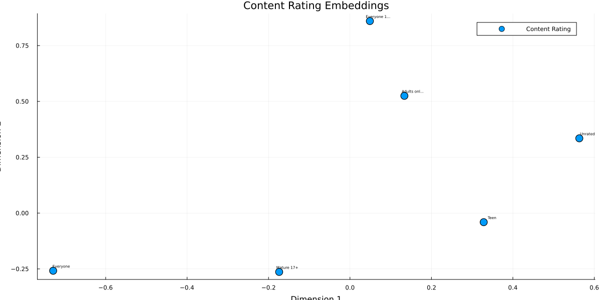
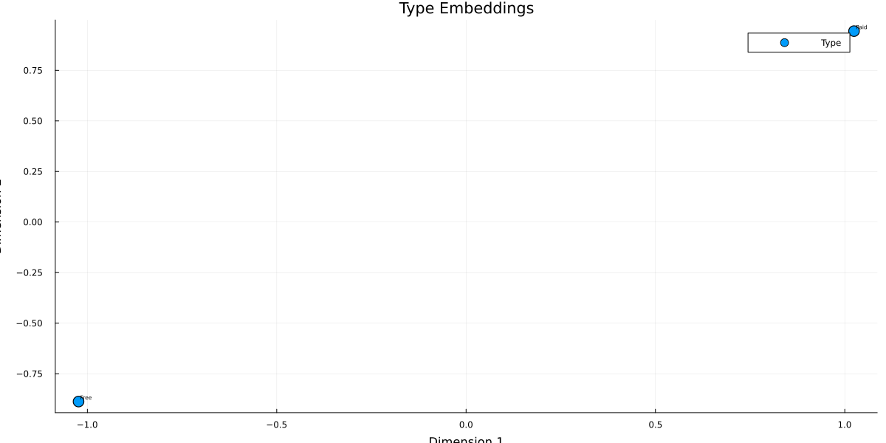

```@meta
EditURL = "notebook.jl"
```

# Entity Embeddings Tutorial

**Julia version** is assumed to be 1.10.*

This demonstration is available as a Jupyter notebook or julia script (as well as the dataset)
[here](https://github.com/FluxML/MLJFlux.jl/tree/dev/docs/src/common_workflows/entity_embeddings).

Entity embedding is a newer deep learning approach for categorical encoding introduced in 2016 by Cheng Guo and Felix Berkhahn.
It employs a set of embedding layers to map each categorical feature into a dense continuous vector in a similar fashion to how they are employed in NLP architectures.

In MLJFlux, the `EntityEmbedder` provides a high-level interface to learn entity embeddings using any supervised MLJFlux model as the underlying learner.
The embedder can be used as a transformer in MLJ pipelines to encode categorical features with learned embeddings, which can then be used as features in downstream machine learning models.

In this tutorial, we will explore how to use the `EntityEmbedder` to learn and apply entity embeddings on the Google Play Store dataset.

## Learning Objectives
- Understand the concept of entity embeddings for categorical encoding
- Learn how to use `EntityEmbedder` from MLJFlux
- Apply entity embeddings to a real-world dataset
- Visualize the learned embedding spaces
- Build pipelines combining embeddings with downstream models

````julia
using Pkg;
Pkg.activate(@__DIR__);


# Import all required packages
using MLJ
using CategoricalArrays
using DataFrames
using Optimisers
using Random
using Tables
using ProgressMeter
using Plots
using ScientificTypes
using CSV
using StatsBase  ## For countmap
import Plots: mm  ## For margin units
````

````
  Activating project at `~/Documents/GitHub/MLJTransforms/docs/src/tutorials/entity_embeddings`

````

## Data Loading and Preprocessing

We'll use the Google Play Store dataset which contains information about mobile applications.
This dataset has several categorical features that are perfect for demonstrating entity embeddings:
- **Category**: App category (e.g., Games, Social, Tools)
- **Content Rating**: Age rating (e.g., Everyone, Teen, Mature)
- **Genres**: Primary genre of the app
- **Android Ver**: Required Android version
- **Type**: Free or Paid

````julia
# Load the Google Play Store dataset
df = CSV.read("./googleplaystore.csv", DataFrame);
````

````
┌ Warning: thread = 1 warning: only found 12 / 13 columns around data row: 10473. Filling remaining columns with `missing`
└ @ CSV ~/.julia/packages/CSV/XLcqT/src/file.jl:592
┌ Warning: thread = 1 warning: only found 12 / 13 columns around data row: 10473. Filling remaining columns with `missing`
└ @ CSV ~/.julia/packages/CSV/XLcqT/src/file.jl:592

````

### Data Cleaning and Type Conversion

The raw dataset requires significant cleaning. We'll handle:
1. **Reviews**: Convert to integers
2. **Size**: Parse size strings like "14M", "512k" to numeric values
3. **Installs**: Remove formatting characters and convert to integers
4. **Price**: Remove dollar signs and convert to numeric
5. **Genres**: Extract primary genre only

````julia
# Custom parsing function that returns missing instead of nothing
safe_parse(T, s) = something(tryparse(T, s), missing);

# Reviews: ensure integer
df.Reviews = safe_parse.(Int, string.(df.Reviews));

# Size: "14M", "512k", or "Varies with device"
function parse_size(s)
    if s == "Varies with device"
        return missing
    elseif occursin('M', s)
        return safe_parse(Float64, replace(s, "M" => "")) * 1_000_000
    elseif occursin('k', s)
        return safe_parse(Float64, replace(s, "k" => "")) * 1_000
    else
        return safe_parse(Float64, s)
    end
end
df.Size = parse_size.(string.(df.Size));

# Installs: strip '+' and ',' then parse
clean_installs = replace.(string.(df.Installs), r"[+,]" => "")
df.Installs = safe_parse.(Int, clean_installs);

# Price: strip leading '$'
df.Price = safe_parse.(Float64, replace.(string.(df.Price), r"^\$" => ""));

# Genres: take only the primary genre
df.Genres = first.(split.(string.(df.Genres), ';'));
````

### Storing Category Information for Visualization

We'll store the unique values of each categorical feature to use later when visualizing the embeddings.

````julia
# Store unique category names for visualization later
category_names = Dict(
    :Category => sort(unique(df.Category)),
    Symbol("Content Rating") => sort(unique(df[!, Symbol("Content Rating")])),
    :Genres => sort(unique(df.Genres)),
    Symbol("Android Ver") => sort(unique(df[!, Symbol("Android Ver")])),
);

println("Category names extracted:")
for (feature, names) in category_names
    println("$feature: $(length(names)) categories")
end
````

````
Category names extracted:
Category: 34 categories
Content Rating: 7 categories
Android Ver: 35 categories
Genres: 49 categories

````

### Feature Selection and Missing Value Handling

We'll select the most relevant features and remove any rows with missing values to ensure clean data for our embedding model.

````julia
select!(
    df,
    [
        :Category, :Reviews, :Size, :Installs, :Type,
        :Price, Symbol("Content Rating"), :Genres, Symbol("Android Ver"), :Rating,
    ],
);
dropmissing!(df);
````

### Creating Categorical Target Variable

For this tutorial, we'll convert the continuous rating into a categorical classification problem.
This will allow us to use a classification model that can learn meaningful embeddings.

We'll create 10 rating categories by rounding to the nearest 0.5 (e.g., 0.0, 0.5, 1.0, ..., 4.5, 5.0).

````julia
# Create 10 classes: 0, 0.5, 1.0, 1.5, 2.0, 2.5, 3.0, 3.5, 4.0, 4.5
function rating_to_categorical(rating)
    # Clamp rating to valid range and round to nearest 0.5
    clamped_rating = clamp(rating, 0.0, 5.0)
    rounded_rating = round(clamped_rating * 2) / 2  ## Round to nearest 0.5
    return string(rounded_rating)
end

# Apply the transformation
df.RatingCategory = categorical([rating_to_categorical(r) for r in df.Rating]);

# Check the distribution of categorical rating labels
println("Distribution of categorical rating labels:")
println(sort(countmap(df.RatingCategory)))
println("\nUnique rating categories: $(sort(unique(df.RatingCategory)))")
````

````
Distribution of categorical rating labels:
OrderedCollections.OrderedDict{CategoricalArrays.CategoricalValue{String, UInt32}, Int64}("1.0" => 17, "1.5" => 18, "2.0" => 53, "2.5" => 105, "3.0" => 281, "3.5" => 722, "4.0" => 2420, "4.5" => 3542, "5.0" => 571, "NaN" => 1416)

Unique rating categories: ["1.0", "1.5", "2.0", "2.5", "3.0", "3.5", "4.0", "4.5", "5.0", "NaN"]

````

### Type Coercion for MLJ

MLJ requires explicit type coercion to understand which columns are categorical vs continuous.
This step is crucial for the `EntityEmbedder` to identify which features need embedding layers.

````julia
# Coerce types for MLJ compatibility
df = coerce(df,
    :Category => Multiclass,
    :Reviews => Continuous,
    :Size => Continuous,
    :Installs => Continuous,
    :Type => Multiclass,
    :Price => Continuous,
    Symbol("Content Rating") => Multiclass,
    :Genres => Multiclass,
    Symbol("Android Ver") => Multiclass,
    :Rating => Continuous,  ## Keep original for reference
    :RatingCategory => Multiclass,  ## New categorical target
);
schema(df)
````

````
┌────────────────┬────────────────┬────────────────────────────────────┐
│ names          │ scitypes       │ types                              │
├────────────────┼────────────────┼────────────────────────────────────┤
│ Category       │ Multiclass{33} │ CategoricalValue{String31, UInt32} │
│ Reviews        │ Continuous     │ Float64                            │
│ Size           │ Continuous     │ Float64                            │
│ Installs       │ Continuous     │ Float64                            │
│ Type           │ Multiclass{2}  │ CategoricalValue{String7, UInt32}  │
│ Price          │ Continuous     │ Float64                            │
│ Content Rating │ Multiclass{6}  │ CategoricalValue{String15, UInt32} │
│ Genres         │ Multiclass{48} │ CategoricalValue{String, UInt32}   │
│ Android Ver    │ Multiclass{34} │ CategoricalValue{String31, UInt32} │
│ Rating         │ Continuous     │ Float64                            │
│ RatingCategory │ Multiclass{10} │ CategoricalValue{String, UInt32}   │
└────────────────┴────────────────┴────────────────────────────────────┘

````

### Data Splitting

We'll split our data into training and testing sets using stratified sampling to ensure balanced representation of rating categories.

````julia
# Split into features and target
y = df[!, :RatingCategory]  ## Use categorical rating as target
X = select(df, Not([:Rating, :RatingCategory]));  ## Exclude both rating columns from features

# Split the data with stratification
(X_train, X_test), (y_train, y_test) = partition(
    (X, y),
    0.8,
    multi = true,
    shuffle = true,
    stratify = y,
    rng = Random.Xoshiro(41),
);

using MLJFlux
````

## Building the EntityEmbedder Model

````julia
# Load the neural network classifier
NeuralNetworkClassifier = @load NeuralNetworkClassifier pkg = MLJFlux
````

````
MLJFlux.NeuralNetworkClassifier
````

### Configuring the Base Neural Network

We'll create a neural network classifier with custom embedding dimensions for each categorical feature.
Setting smaller embedding dimensions (like 2D) makes it easier to visualize the learned representations.

````julia
# Create the underlying supervised model that will learn the embeddings
base_clf = NeuralNetworkClassifier(
    builder = MLJFlux.Short(n_hidden = 14),
    optimiser = Optimisers.Adam(10e-2),
    batch_size = 20,
    epochs = 5,
    acceleration = CUDALibs(),
    embedding_dims = Dict(
        :Category => 2,
        :Type => 2,
        Symbol("Content Rating") => 2,
        :Genres => 2,
        Symbol("Android Ver") => 2,
    ),
    rng = 39,
);
````

````
┌ Info: The CUDA functionality is being called but
│ `CUDA.jl` must be loaded to access it.
└ Add `using CUDA` or `import CUDA` to your code.  Alternatively, configure a different GPU backend by calling `Flux.gpu_backend!`.
┌ Warning: `acceleration isa CUDALibs` but no CUDA device (GPU) currently live. Specifying an RNG seed when `acceleration isa CUDALibs()` may fail for layers depending on an RNG during training, such as `Dropout`. Consider using  `Random.default_rng()` instead. `
└ @ MLJFlux ~/.julia/packages/MLJFlux/5eWpt/src/types.jl:62

````

### Creating the EntityEmbedder

The `EntityEmbedder` wraps our neural network and can be used as a transformer in MLJ pipelines.
By default, it uses `min(n_categories - 1, 10)` dimensions for any categorical feature not explicitly specified.

````julia
# Create the EntityEmbedder using the neural network
embedder = EntityEmbedder(base_clf)
````

````
EntityEmbedder(
  model = NeuralNetworkClassifier(
        builder = Short(n_hidden = 14, …), 
        finaliser = NNlib.softmax, 
        optimiser = Adam(0.1, (0.9, 0.999), 1.0e-8), 
        loss = Flux.Losses.crossentropy, 
        epochs = 5, 
        batch_size = 20, 
        lambda = 0.0, 
        alpha = 0.0, 
        rng = 39, 
        optimiser_changes_trigger_retraining = false, 
        acceleration = ComputationalResources.CUDALibs{Nothing}(nothing), 
        embedding_dims = Dict{Symbol, Real}(:Category => 2, Symbol("Content Rating") => 2, Symbol("Android Ver") => 2, :Genres => 2, :Type => 2)))
````

## Training the EntityEmbedder

Now we'll train the embedder on our training data. The model learns to predict app ratings while simultaneously learning meaningful embeddings for categorical features.

````julia
# Create and train the machine
mach = machine(embedder, X_train, y_train)
MLJ.fit!(mach, force = true, verbosity = 1);
````

````
[ Info: Training machine(EntityEmbedder(model = NeuralNetworkClassifier(builder = Short(n_hidden = 14, …), …)), …).
┌ Info: The CUDA functionality is being called but
│ `CUDA.jl` must be loaded to access it.
└ Add `using CUDA` or `import CUDA` to your code.  Alternatively, configure a different GPU backend by calling `Flux.gpu_backend!`.
[ Info: MLJFlux: converting input data to Float32

Optimising neural net:  33%[========>                ]  ETA: 0:00:00
Optimising neural net:  50%[============>            ]  ETA: 0:00:00
Optimising neural net:  67%[================>        ]  ETA: 0:00:00
Optimising neural net:  83%[====================>    ]  ETA: 0:00:00
Optimising neural net: 100%[=========================] Time: 0:00:00

````

### Transforming Data with Learned Embeddings

After training, we can use the embedder as a transformer to convert categorical features into their learned embedding representations.

````julia
# Transform the data using the learned embeddings
X_train_embedded = MLJFlux.transform(mach, X_train)
X_test_embedded = MLJFlux.transform(mach, X_test);

# Check the schema transformation
println("Original schema:")
schema(X_train)
println("\nEmbedded schema:")
schema(X_train_embedded)
````

````
Original schema:

Embedded schema:

````

## Using Embeddings in ML Pipelines

One of the key advantages of entity embeddings is that they can be used as features in any downstream machine learning model.
Let's create a pipeline that combines our `EntityEmbedder` with a k-nearest neighbors classifier.

````julia
# Load KNN classifier
KNNClassifier = @load KNNClassifier pkg = NearestNeighborModels

# Create a pipeline: EntityEmbedder -> KNNClassifier
pipe = embedder |> KNNClassifier(K = 5);

# Train the pipeline
pipe_mach = machine(pipe, X_train, y_train)
MLJ.fit!(pipe_mach, verbosity = 0)
````

````
trained Machine; does not cache data
  model: ProbabilisticPipeline(entity_embedder = EntityEmbedder(model = NeuralNetworkClassifier(builder = Short(n_hidden = 14, …), …)), …)
  args: 
    1:	Source @225 ⏎ ScientificTypesBase.Table{Union{AbstractVector{ScientificTypesBase.Continuous}, AbstractVector{ScientificTypesBase.Multiclass{33}}, AbstractVector{ScientificTypesBase.Multiclass{2}}, AbstractVector{ScientificTypesBase.Multiclass{6}}, AbstractVector{ScientificTypesBase.Multiclass{48}}, AbstractVector{ScientificTypesBase.Multiclass{34}}}}
    2:	Source @148 ⏎ AbstractVector{ScientificTypesBase.Multiclass{10}}

````

## Visualizing the Learned Embedding Spaces

One of the most powerful aspects of entity embeddings is their interpretability. Since we used 2D embeddings, we can visualize how the model has organized different categories in the embedding space.

````julia
# Extract the learned embedding matrices from the fitted model
mapping_matrices = fitted_params(mach)[4]
````

````
Dict{Symbol, Matrix{Float32}} with 5 entries:
  :Category => [-0.334237 -0.0392749 0.104473 0.256099 -0.0655005 -0.141202 -0.0970246 0.179792 -0.270771 -0.214171 -0.12692 0.41105 0.256761 -0.0494666 -0.111133 0.285277 -0.331778 0.328676 -0.342993 -0.129262 -0.230373 -0.038213 0.108276 -0.153902 -0.324451 -0.237727 0.0345672 -0.0572035 -0.0585397 -0.288544 -0.242574 0.257894 0.00108838; 0.165236 -0.296432 -0.404019 -0.294493 0.185582 0.309341 -0.264846 -0.0410865 0.262034 0.384784 -0.0927044 0.0317509 0.232903 -0.406631 0.288323 0.0836039 0.334631 0.293926 0.290643 -0.334773 -0.306882 -0.00893126 0.185925 -0.309297 0.237027 0.0541817 0.39381 -0.400486 -0.123453 -0.163497 -0.00332076 0.0662401 0.160035]
  Symbol("Content Rating") => [0.133581 -0.728943 0.0488496 -0.17392 0.32843 0.563167; 0.525009 -0.258198 0.859755 -0.263517 -0.040722 0.33474]
  Symbol("Android Ver") => [0.170607 0.141154 -0.39162 0.403547 0.196919 -0.384571 -0.148519 -0.130053 0.170175 0.0752836 0.0634965 0.188923 0.179924 -0.346638 0.213056 0.104962 -0.0845368 -0.154221 -0.121818 -0.303438 0.275882 -0.201961 0.0978208 0.212295 -0.00877398 -0.296715 -0.0364835 -0.285863 -0.249095 0.00626427 -0.262972 0.152306 -0.131261 0.177531; -0.100683 -0.194721 0.364714 -0.199976 0.0840546 0.196454 -0.288194 0.215619 -0.282248 -0.0873126 -0.351141 0.0446604 0.37886 -0.151878 0.173701 -0.285421 -0.288342 0.270182 -0.181768 0.0513307 -0.0748576 0.303714 -0.230258 -0.123035 0.147936 0.169242 0.172273 -0.048809 -0.19322 0.239702 -0.130154 -0.407279 0.158713 0.322129]
  :Genres => [-0.146774 -0.310947 0.163455 0.186525 0.209192 -0.0957032 -0.309449 0.0804618 -0.289171 -0.105948 0.18964 -0.0232951 -0.303402 0.104239 0.213892 -0.0944015 -0.0128954 0.25166 -0.14625 0.340541 0.278481 0.118645 0.049088 -0.269987 -0.336882 -0.0115204 -0.121047 -0.269735 0.233099 -0.159103 -0.0351166 -0.102524 0.0211413 -0.0635436 -0.309698 -0.150375 -0.294988 0.243549 -0.121398 -0.257364 0.309162 0.260066 -0.32487 0.0512156 -0.113218 -0.128149 -0.285641 0.32328; -0.0240456 -0.0927238 -0.320587 -0.337704 0.265411 -0.102303 0.254456 0.288764 0.0950742 0.343972 -0.0132413 0.106584 0.0865783 -0.0157523 -0.121958 0.205434 -0.0508129 0.200128 -0.330792 0.337839 0.226497 0.131038 0.0368269 -0.243523 -0.259971 -0.144437 0.282105 0.223037 -0.0473506 0.131549 -0.22308 0.0791805 -0.17695 0.0639658 -0.344229 -0.274745 0.238469 0.0954359 0.340802 -0.0461901 -0.242701 0.016714 -0.0969492 0.142659 -0.0661325 0.165366 0.0977414 0.255571]
  :Type => [-1.02336 1.02435; -0.887775 0.944183]
````

### Creating Embedding Visualization Function

We'll create a helper function to plot the 2D embedding space for each categorical feature.
Each point represents a category, and its position shows how the model learned to represent it.

````julia
# Function to create and display scatter plot for categorical embeddings
function plot_categorical_embeddings(feature_name, feature_categories, embedding_matrix)
    # Convert feature_name to string to handle both Symbol and String inputs
    feature_name_str = string(feature_name)

    # Create scatter plot for this feature's embeddings
    p = scatter(embedding_matrix[1, :], embedding_matrix[2, :],
        title = "$(feature_name_str) Embeddings",
        xlabel = "Dimension 1",
        ylabel = "Dimension 2",
        label = "$(feature_name_str)",
        legend = :topright,
        markersize = 8,
        size = (1200, 600))

    # Annotate each point with the actual category name
    for (i, col) in enumerate(eachcol(embedding_matrix))
        if i <= length(feature_categories)
            cat_name = string(feature_categories[i])
            # Truncate long category names for readability
            display_name = length(cat_name) > 10 ? cat_name[1:10] * "..." : cat_name
            annotate!(p, col[1] + 0.02, col[2] + 0.02, text(display_name, :black, 5))
        end
    end

    # Save the plot

    # Display the plot
    return p
end;
````

### Generating Embedding Plots for Each Categorical Feature

Let's visualize the embedding space for each of our categorical features to understand what patterns the model learned.

````julia
# Create separate plots for each categorical feature's embeddings

# Plot 1: Category embeddings
plot_categorical_embeddings(
    :Category,
    category_names[:Category],
    mapping_matrices[:Category],
);
````

````
Displayed embedding plot for: Category

````


Notice that pairs such as social and entertainment, shopping and finance, and comics and art are closer together than others.

````julia
# Plot 2: Content Rating embeddings
plot_categorical_embeddings(
    Symbol("Content Rating"),
    category_names[Symbol("Content Rating")],
    mapping_matrices[Symbol("Content Rating")],
);
````

````
Displayed embedding plot for: Content Rating

````


The `Everyone` category is positioned far from all others.

````julia
# Plot 3: Genres embeddings
plot_categorical_embeddings(:Genres, category_names[:Genres], mapping_matrices[:Genres]);
````

````
Displayed embedding plot for: Genres

````


Here the results may be less interpretable; the idea is that for purposes of indetifying the rating, the model considered categories closer together as more similar.

````julia
# Plot 4: Android Ver embeddings
plot_categorical_embeddings(
    Symbol("Android Ver"),
    category_names[Symbol("Android Ver")],
    mapping_matrices[Symbol("Android Ver")],
);
````

````
Displayed embedding plot for: Android Ver

````


Clear patterns like close proximity between (7.1 and up) and, 7.0-7.1

````julia
# Plot 5: Type embeddings (if it exists in the mapping)
plot_categorical_embeddings(:Type, sort(unique(df.Type)), mapping_matrices[:Type]);
````

````
Displayed embedding plot for: Type

````


Indeed, `Free` and `Paid` are too dissimilar.

This demonstrates the power of entity embeddings as a modern approach to categorical feature encoding that goes beyond traditional methods like one-hot encoding or label encoding.

---

*This page was generated using [Literate.jl](https://github.com/fredrikekre/Literate.jl).*

