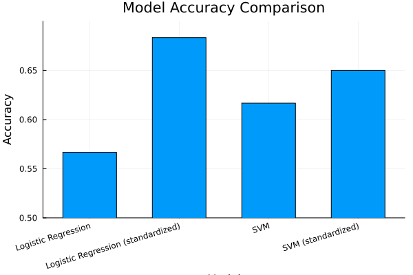

```@meta
EditURL = "notebook.jl"
```

# Effects of Feature Standardization on Model Performance

Welcome to this tutorial on feature standardization in machine learning!
In this tutorial, we'll explore how standardizing features can significantly
impact the performance of different machine learning models.

We'll compare Logistic Regression and Support Vector Machine (SVM) models,
both with and without feature standardization. This will help us understand
when and why preprocessing is important for model performance.

This demonstration is available as a Jupyter notebook or julia script
[here](https://github.com/essamwise/MLJTransforms.jl/tree/main/docs/src/tutorials/standardization).

````julia
using Pkg
Pkg.activate(@__DIR__);
Pkg.instantiate();
````

````
  Activating project at `~/Documents/GitHub/MLJTransforms/docs/src/tutorials/standardization`

````

## Setup

First, let's make sure we're using a compatible Julia version. This code was tested with Julia 1.10.
Let's import all the packages we'll need for this tutorial.

````julia
# Load the necessary packages
using MLJ                   # Core MLJ framework
using LIBSVM                # For Support Vector Machine
using DataFrames            # For displaying results
using RDatasets             # To load sample datasets
using Random                # For reproducibility
using ScientificTypes       # For proper data typing
using Plots                 # For visualizations
using MLJLinearModels       # For Logistic Regression
````

## Data Preparation

Let's load the Pima Indians Diabetes Dataset. This is a classic dataset for
binary classification, where we predict diabetes status based on various health metrics.

The interesting thing about this dataset is that different features have very different scales.
We'll artificially exaggerate this by adding a large constant to the glucose values.

````julia
# Load the dataset and modify it to have extreme scale differences
df = RDatasets.dataset("MASS", "Pima.tr")
df.Glu .+= 10000.0;  # Artificially increase the scale of glucose values
````

Let's examine the first few rows of our dataset:

````julia
first(df, 5)
````

```@raw html
<div><div style = "float: left;"><span>5×8 DataFrame</span></div><div style = "clear: both;"></div></div><div class = "data-frame" style = "overflow-x: scroll;"><table class = "data-frame" style = "margin-bottom: 6px;"><thead><tr class = "header"><th class = "rowNumber" style = "font-weight: bold; text-align: right;">Row</th><th style = "text-align: left;">NPreg</th><th style = "text-align: left;">Glu</th><th style = "text-align: left;">BP</th><th style = "text-align: left;">Skin</th><th style = "text-align: left;">BMI</th><th style = "text-align: left;">Ped</th><th style = "text-align: left;">Age</th><th style = "text-align: left;">Type</th></tr><tr class = "subheader headerLastRow"><th class = "rowNumber" style = "font-weight: bold; text-align: right;"></th><th title = "Int32" style = "text-align: left;">Int32</th><th title = "Float64" style = "text-align: left;">Float64</th><th title = "Int32" style = "text-align: left;">Int32</th><th title = "Int32" style = "text-align: left;">Int32</th><th title = "Float64" style = "text-align: left;">Float64</th><th title = "Float64" style = "text-align: left;">Float64</th><th title = "Int32" style = "text-align: left;">Int32</th><th title = "CategoricalArrays.CategoricalValue{String, UInt8}" style = "text-align: left;">Cat…</th></tr></thead><tbody><tr><td class = "rowNumber" style = "font-weight: bold; text-align: right;">1</td><td style = "text-align: right;">5</td><td style = "text-align: right;">10086.0</td><td style = "text-align: right;">68</td><td style = "text-align: right;">28</td><td style = "text-align: right;">30.2</td><td style = "text-align: right;">0.364</td><td style = "text-align: right;">24</td><td style = "text-align: left;">No</td></tr><tr><td class = "rowNumber" style = "font-weight: bold; text-align: right;">2</td><td style = "text-align: right;">7</td><td style = "text-align: right;">10195.0</td><td style = "text-align: right;">70</td><td style = "text-align: right;">33</td><td style = "text-align: right;">25.1</td><td style = "text-align: right;">0.163</td><td style = "text-align: right;">55</td><td style = "text-align: left;">Yes</td></tr><tr><td class = "rowNumber" style = "font-weight: bold; text-align: right;">3</td><td style = "text-align: right;">5</td><td style = "text-align: right;">10077.0</td><td style = "text-align: right;">82</td><td style = "text-align: right;">41</td><td style = "text-align: right;">35.8</td><td style = "text-align: right;">0.156</td><td style = "text-align: right;">35</td><td style = "text-align: left;">No</td></tr><tr><td class = "rowNumber" style = "font-weight: bold; text-align: right;">4</td><td style = "text-align: right;">0</td><td style = "text-align: right;">10165.0</td><td style = "text-align: right;">76</td><td style = "text-align: right;">43</td><td style = "text-align: right;">47.9</td><td style = "text-align: right;">0.259</td><td style = "text-align: right;">26</td><td style = "text-align: left;">No</td></tr><tr><td class = "rowNumber" style = "font-weight: bold; text-align: right;">5</td><td style = "text-align: right;">0</td><td style = "text-align: right;">10107.0</td><td style = "text-align: right;">60</td><td style = "text-align: right;">25</td><td style = "text-align: right;">26.4</td><td style = "text-align: right;">0.133</td><td style = "text-align: right;">23</td><td style = "text-align: left;">No</td></tr></tbody></table></div>
```

### Data Type Conversion

In MLJ, it's important to ensure that our data has the correct scientific types.
This helps the framework understand how to properly handle each column.

We'll convert our columns to their appropriate types:
- `Count` for discrete count data
- `Continuous` for continuous numerical data
- `Multiclass` for our target variable

````julia
# Coerce columns to the right scientific types
df = coerce(df,
    :NPreg => Count,      # Number of pregnancies is a count
    :Glu => Continuous,   # Glucose level is continuous
    :BP => Continuous,    # Blood pressure is continuous
    :Skin => Continuous,  # Skin thickness is continuous
    :BMI => Continuous,   # Body mass index is continuous
    :Ped => Continuous,   # Diabetes pedigree is continuous
    :Age => Continuous,   # Age is continuous
    :Type => Multiclass,  # Diabetes status is our target (Yes/No)
);
````

Let's verify that our schema looks correct:

````julia
ScientificTypes.schema(df)
````

````
┌───────┬───────────────┬─────────────────────────────────┐
│ names │ scitypes      │ types                           │
├───────┼───────────────┼─────────────────────────────────┤
│ NPreg │ Count         │ Int32                           │
│ Glu   │ Continuous    │ Float64                         │
│ BP    │ Continuous    │ Float64                         │
│ Skin  │ Continuous    │ Float64                         │
│ BMI   │ Continuous    │ Float64                         │
│ Ped   │ Continuous    │ Float64                         │
│ Age   │ Continuous    │ Float64                         │
│ Type  │ Multiclass{2} │ CategoricalValue{String, UInt8} │
└───────┴───────────────┴─────────────────────────────────┘

````

## Feature Extraction and Data Splitting

Now we'll separate our features from our target variable.
In MLJ, this is done with the `unpack` function.

````julia
# Unpack features (X) and target (y)
y, X = unpack(df, ==(:Type); rng = 123);
````

Next, we'll split our data into training and testing sets.
We'll use 70% for training and 30% for testing.

````julia
# Split data into train and test sets
train, test = partition(eachindex(y), 0.7, shuffle = true, rng = 123);
````

## Model Setup

We'll compare two different models:
1. Logistic Regression: A linear model good for binary classification
2. Support Vector Machine (SVM): A powerful non-linear classifier

For each model, we'll create two versions:
- One without standardization
- One with standardization

The `Standardizer` transformer will rescale our features to have mean 0 and standard deviation 1.

````julia
# Load our models from their respective packages
logreg = @load LogisticClassifier pkg = MLJLinearModels
svm = @load SVC pkg = LIBSVM
stand = Standardizer()  # This is our standardization transformer

# Create pipelines for each model variant
logreg_pipe = logreg()  # Plain logistic regression
logreg_std_pipe = Pipeline(stand, logreg())  # Logistic regression with standardization
svm_pipe = svm()  # Plain SVM
svm_std_pipe = Pipeline(stand, svm())  # SVM with standardization
````

````
DeterministicPipeline(
  standardizer = Standardizer(
        features = Symbol[], 
        ignore = false, 
        ordered_factor = false, 
        count = false), 
  svc = SVC(
        kernel = LIBSVM.Kernel.RadialBasis, 
        gamma = 0.0, 
        cost = 1.0, 
        cachesize = 200.0, 
        degree = 3, 
        coef0 = 0.0, 
        tolerance = 0.001, 
        shrinking = true), 
  cache = true)
````

## Model Evaluation

Let's set up a vector of our models so we can evaluate them all using the same process.
For each model, we'll store its name and the corresponding pipeline.

````julia
# Create a list of models to evaluate
models = [
    ("Logistic Regression", logreg_pipe),
    ("Logistic Regression (standardized)", logreg_std_pipe),
    ("SVM", svm_pipe),
    ("SVM (standardized)", svm_std_pipe),
]
````

````
4-element Vector{Tuple{String, MLJModelInterface.Supervised}}:
 ("Logistic Regression", LogisticClassifier(lambda = 2.220446049250313e-16, …))
 ("Logistic Regression (standardized)", ProbabilisticPipeline(standardizer = Standardizer(features = Symbol[], …), …))
 ("SVM", SVC(kernel = RadialBasis, …))
 ("SVM (standardized)", DeterministicPipeline(standardizer = Standardizer(features = Symbol[], …), …))
````

Now we'll loop through each model, train it, make predictions, and calculate accuracy.
This will help us compare how standardization affects each model's performance.

````julia
# Train and evaluate each model
results = DataFrame(model = String[], accuracy = Float64[])
for (name, model) in models
    # Create a machine learning model
    mach = machine(model, X, y)

    # Train the model on the training data
    MLJ.fit!(mach, rows = train)

    # Make predictions on the test data
    # Note: Logistic regression returns probabilities, so we need to get the mode
    yhat =
        occursin("Logistic Regression", name) ?
        MLJ.predict_mode(mach, rows = test) :  # Get most likely class for logistic regression
        MLJ.predict(mach, rows = test)         # SVM directly predicts the class

    # Calculate accuracy
    acc = accuracy(yhat, y[test])

    # Store the results
    push!(results, (name, acc))
end
````

````
┌ Warning: The number and/or types of data arguments do not match what the specified model
│ supports. Suppress this type check by specifying `scitype_check_level=0`.
│ 
│ Run `@doc MLJLinearModels.LogisticClassifier` to learn more about your model's requirements.
│ 
│ Commonly, but non exclusively, supervised models are constructed using the syntax
│ `machine(model, X, y)` or `machine(model, X, y, w)` while most other models are
│ constructed with `machine(model, X)`.  Here `X` are features, `y` a target, and `w`
│ sample or class weights.
│ 
│ In general, data in `machine(model, data...)` is expected to satisfy
│ 
│     scitype(data) <: MLJ.fit_data_scitype(model)
│ 
│ In the present case:
│ 
│ scitype(data) = Tuple{ScientificTypesBase.Table{Union{AbstractVector{ScientificTypesBase.Continuous}, AbstractVector{ScientificTypesBase.Count}}}, AbstractVector{ScientificTypesBase.Multiclass{2}}}
│ 
│ fit_data_scitype(model) = Tuple{ScientificTypesBase.Table{<:AbstractVector{<:ScientificTypesBase.Continuous}}, AbstractVector{<:ScientificTypesBase.Finite}}
└ @ MLJBase ~/.julia/packages/MLJBase/F1Eh6/src/machines.jl:237
[ Info: Training machine(LogisticClassifier(lambda = 2.220446049250313e-16, …), …).
┌ Info: Solver: MLJLinearModels.LBFGS{Optim.Options{Float64, Nothing}, @NamedTuple{}}
│   optim_options: Optim.Options{Float64, Nothing}
└   lbfgs_options: @NamedTuple{} NamedTuple()
[ Info: Training machine(ProbabilisticPipeline(standardizer = Standardizer(features = Symbol[], …), …), …).
[ Info: Training machine(:standardizer, …).
[ Info: Training machine(:logistic_classifier, …).
┌ Info: Solver: MLJLinearModels.LBFGS{Optim.Options{Float64, Nothing}, @NamedTuple{}}
│   optim_options: Optim.Options{Float64, Nothing}
└   lbfgs_options: @NamedTuple{} NamedTuple()
┌ Warning: The number and/or types of data arguments do not match what the specified model
│ supports. Suppress this type check by specifying `scitype_check_level=0`.
│ 
│ Run `@doc LIBSVM.SVC` to learn more about your model's requirements.
│ 
│ Commonly, but non exclusively, supervised models are constructed using the syntax
│ `machine(model, X, y)` or `machine(model, X, y, w)` while most other models are
│ constructed with `machine(model, X)`.  Here `X` are features, `y` a target, and `w`
│ sample or class weights.
│ 
│ In general, data in `machine(model, data...)` is expected to satisfy
│ 
│     scitype(data) <: MLJ.fit_data_scitype(model)
│ 
│ In the present case:
│ 
│ scitype(data) = Tuple{ScientificTypesBase.Table{Union{AbstractVector{ScientificTypesBase.Continuous}, AbstractVector{ScientificTypesBase.Count}}}, AbstractVector{ScientificTypesBase.Multiclass{2}}}
│ 
│ fit_data_scitype(model) = Union{Tuple{ScientificTypesBase.Table{<:AbstractVector{<:ScientificTypesBase.Continuous}}, AbstractVector{<:ScientificTypesBase.Finite}}, Tuple{ScientificTypesBase.Table{<:AbstractVector{<:ScientificTypesBase.Continuous}}, AbstractVector{<:ScientificTypesBase.Finite}, Any}}
└ @ MLJBase ~/.julia/packages/MLJBase/F1Eh6/src/machines.jl:237
[ Info: Training machine(SVC(kernel = RadialBasis, …), …).
[ Info: Training machine(DeterministicPipeline(standardizer = Standardizer(features = Symbol[], …), …), …).
[ Info: Training machine(:standardizer, …).
[ Info: Training machine(:svc, …).

````

## Results Visualization

Finally, let's visualize our results to see the impact of standardization.
We'll create a bar chart comparing the accuracy of each model.

````julia
# Create a bar chart of model performance
p = bar(
    results.model,
    results.accuracy,
    xlabel = "Model",
    ylabel = "Accuracy",
    title = "Model Accuracy Comparison",
    legend = false,
    bar_width = 0.6,
    ylims = (0.5, 0.7),
    xrotation = 17,
);
````

Save the plot




## Conclusion

From this tutorial, we can clearly see that standardization has a dramatic impact on model performance.

Looking at the results:

- **Logistic Regression**: Without standardization, it achieves only ~57% accuracy. With standardization,
  its performance jumps dramatically to ~68% accuracy – the best performance among all models.

- **SVM**: The baseline SVM achieves ~62% accuracy. When standardized, it improves to ~65% accuracy,
  which is a significant boost but not as dramatic as what we see with logistic regression.

Try this approach with other datasets and models to further explore the effects of standardization!

## Further Resources

* [MLJTransforms Documentation](<unknown>)
* [Scientific Types in MLJ](https://alan-turing-institute.github.io/ScientificTypes.jl/dev/)
* [Feature Preprocessing in MLJ](https://alan-turing-institute.github.io/MLJ.jl/dev/transformers/)

---

*This page was generated using [Literate.jl](https://github.com/fredrikekre/Literate.jl).*

