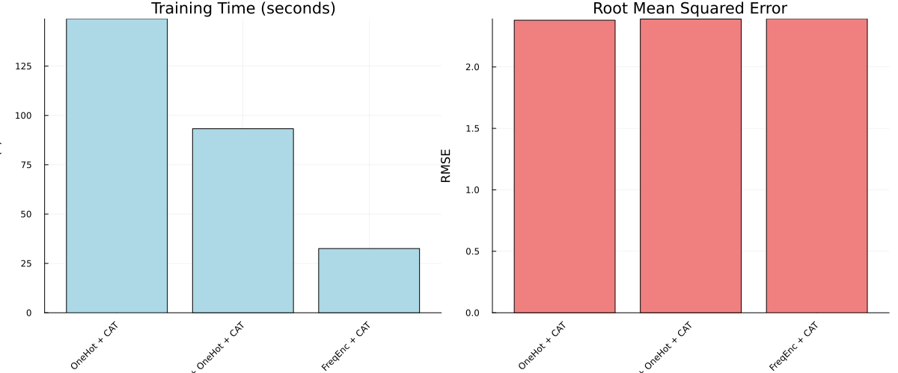

```@meta
EditURL = "notebook.jl"
```

# Wine Quality Prediction: Comparing Categorical Encoders

**Julia version** is assumed to be 1.10.*

This demonstration is available as a Jupyter notebook or julia script (as well as the dataset)
[here](https://github.com/essamwise/MLJTransforms.jl/tree/main/docs/src/tutorials/wine_example).

This tutorial compares different categorical encoding approaches on wine quality prediction.
We'll test OneHot, Frequency, and Cardinality Reduction encoders with CatBoost regression.

**Why compare encoders?** Categorical variables with many levels (like wine varieties)
can create high-dimensional sparse features. Different encoding strategies handle this
challenge differently, affecting both model performance and training speed.

Note: we do not endorse drinking alcohol, this tutorial is purely for educational purposes.

````julia
using Pkg;
Pkg.activate(@__DIR__);

using MLJ, MLJTransforms, DataFrames, ScientificTypes
using Random, CSV, StatsBase, Plots;
````

````
  Activating project at `~/Documents/GitHub/MLJTransforms/docs/src/tutorials/wine_example`

````

## Load and Prepare Data
Load the wine dataset and take a sample for faster computation.
The dataset contains wine reviews with categorical features like variety, winery, and region:

````julia
df = CSV.read("./clean_wine.csv", DataFrame)

first(df, 5)
````

```@raw html
<div><div style = "float: left;"><span>5×8 DataFrame</span></div><div style = "clear: both;"></div></div><div class = "data-frame" style = "overflow-x: scroll;"><table class = "data-frame" style = "margin-bottom: 6px;"><thead><tr class = "header"><th class = "rowNumber" style = "font-weight: bold; text-align: right;">Row</th><th style = "text-align: left;">country</th><th style = "text-align: left;">points</th><th style = "text-align: left;">price</th><th style = "text-align: left;">province</th><th style = "text-align: left;">region_1</th><th style = "text-align: left;">region_2</th><th style = "text-align: left;">variety</th><th style = "text-align: left;">winery</th></tr><tr class = "subheader headerLastRow"><th class = "rowNumber" style = "font-weight: bold; text-align: right;"></th><th title = "InlineStrings.String3" style = "text-align: left;">String3</th><th title = "Int64" style = "text-align: left;">Int64</th><th title = "Float64" style = "text-align: left;">Float64</th><th title = "InlineStrings.String15" style = "text-align: left;">String15</th><th title = "String" style = "text-align: left;">String</th><th title = "InlineStrings.String31" style = "text-align: left;">String31</th><th title = "String" style = "text-align: left;">String</th><th title = "String" style = "text-align: left;">String</th></tr></thead><tbody><tr><td class = "rowNumber" style = "font-weight: bold; text-align: right;">1</td><td style = "text-align: left;">US</td><td style = "text-align: right;">87</td><td style = "text-align: right;">14.0</td><td style = "text-align: left;">Oregon</td><td style = "text-align: left;">Willamette Valley</td><td style = "text-align: left;">Willamette Valley</td><td style = "text-align: left;">Pinot Gris</td><td style = "text-align: left;">Rainstorm</td></tr><tr><td class = "rowNumber" style = "font-weight: bold; text-align: right;">2</td><td style = "text-align: left;">US</td><td style = "text-align: right;">87</td><td style = "text-align: right;">65.0</td><td style = "text-align: left;">Oregon</td><td style = "text-align: left;">Willamette Valley</td><td style = "text-align: left;">Willamette Valley</td><td style = "text-align: left;">Pinot Noir</td><td style = "text-align: left;">Sweet Cheeks</td></tr><tr><td class = "rowNumber" style = "font-weight: bold; text-align: right;">3</td><td style = "text-align: left;">US</td><td style = "text-align: right;">87</td><td style = "text-align: right;">19.0</td><td style = "text-align: left;">California</td><td style = "text-align: left;">Napa Valley</td><td style = "text-align: left;">Napa</td><td style = "text-align: left;">Cabernet Sauvignon</td><td style = "text-align: left;">Kirkland Signature</td></tr><tr><td class = "rowNumber" style = "font-weight: bold; text-align: right;">4</td><td style = "text-align: left;">US</td><td style = "text-align: right;">87</td><td style = "text-align: right;">34.0</td><td style = "text-align: left;">California</td><td style = "text-align: left;">Alexander Valley</td><td style = "text-align: left;">Sonoma</td><td style = "text-align: left;">Cabernet Sauvignon</td><td style = "text-align: left;">Louis M. Martini</td></tr><tr><td class = "rowNumber" style = "font-weight: bold; text-align: right;">5</td><td style = "text-align: left;">US</td><td style = "text-align: right;">87</td><td style = "text-align: right;">12.0</td><td style = "text-align: left;">California</td><td style = "text-align: left;">Central Coast</td><td style = "text-align: left;">Central Coast</td><td style = "text-align: left;">Chardonnay</td><td style = "text-align: left;">Mirassou</td></tr></tbody></table></div>
```

Sample 10,000 rows for faster computation (the full dataset is quite large):

````julia
df = df[sample(1:nrow(df), 10000, replace = false), :];
````

Coerce categorical columns to appropriate scientific types. We use `autotype` to automatically detect
categorical features by recognizing columns with few unique values:

````julia
df = coerce(df, autotype(df, :few_to_finite));
df = coerce(df, :points => Continuous, :region_1 => Multiclass,
    :variety => Multiclass, :winery => Multiclass);
````

## Split Data
Separate features (X) from target (y), then split into train/test sets:

````julia
y, X = unpack(df, ==(:points); rng = 123);
train, test = partition(eachindex(y), 0.8, shuffle = true, rng = 100);
````

## Setup Encoders and Model
Load the required models and create different encoding strategies:

````julia
OneHot = @load OneHotEncoder pkg = MLJModels verbosity = 0
CatBoostRegressor = @load CatBoostRegressor pkg = CatBoost
````

````
CatBoost.MLJCatBoostInterface.CatBoostRegressor
````

**Encoding Strategies:**
1. **OneHotEncoder**: Creates binary columns for each category
2. **FrequencyEncoder**: Replaces categories with their frequency counts
In case of the one-hot-encoder, we worry when categories have high cardinality as that would lead to an explosion in the number of features.

````julia
card_reducer = MLJTransforms.CardinalityReducer(min_frequency = 10, ordered_factor = true)
onehot_model = OneHot(drop_last = true, ordered_factor = true)
freq_model = MLJTransforms.FrequencyEncoder(normalize = false, ordered_factor = true)
cat = CatBoostRegressor();
````

Create three different pipelines to compare:

````julia
pipelines = [
    ("CardRed + OneHot + CAT", card_reducer |> onehot_model |> cat),
    ("OneHot + CAT", onehot_model |> cat),
    ("FreqEnc + CAT", freq_model |> cat),
]
````

````
3-element Vector{Tuple{String, MLJBase.DeterministicPipeline{N, MLJModelInterface.predict} where N<:NamedTuple}}:
 ("CardRed + OneHot + CAT", DeterministicPipeline(cardinality_reducer = CardinalityReducer(features = Symbol[], …), …))
 ("OneHot + CAT", DeterministicPipeline(one_hot_encoder = OneHotEncoder(features = Symbol[], …), …))
 ("FreqEnc + CAT", DeterministicPipeline(frequency_encoder = FrequencyEncoder(features = Symbol[], …), …))
````

## Evaluate Pipelines
Train each pipeline and measure both performance (RMSE) and training time:

````julia
results = DataFrame(pipeline = String[], rmse = Float64[], training_time = Float64[]);

for (name, pipe) in pipelines
    println("Training: $name")
    mach = machine(pipe, X, y)
    training_time = @elapsed MLJ.fit!(mach, rows = train)
    predictions = MLJ.predict(mach, rows = test)
    rmse_value = MLJ.root_mean_squared_error(y[test], predictions)
    push!(results, (name, rmse_value, training_time))
end
````

````
Training: CardRed + OneHot + CAT
[ Info: Training machine(DeterministicPipeline(cardinality_reducer = CardinalityReducer(features = Symbol[], …), …), …).
[ Info: Training machine(:cardinality_reducer, …).
[ Info: Training machine(:one_hot_encoder, …).
[ Info: Spawning 0 sub-features to one-hot encode feature :country.
[ Info: Spawning 3 sub-features to one-hot encode feature :province.
[ Info: Spawning 88 sub-features to one-hot encode feature :region_1.
[ Info: Spawning 16 sub-features to one-hot encode feature :region_2.
[ Info: Spawning 48 sub-features to one-hot encode feature :variety.
[ Info: Spawning 408 sub-features to one-hot encode feature :winery.
[ Info: Training machine(:cat_boost_regressor, …).
Training: OneHot + CAT
[ Info: Training machine(DeterministicPipeline(one_hot_encoder = OneHotEncoder(features = Symbol[], …), …), …).
[ Info: Training machine(:one_hot_encoder, …).
[ Info: Spawning 0 sub-features to one-hot encode feature :country.
[ Info: Spawning 3 sub-features to one-hot encode feature :province.
[ Info: Spawning 157 sub-features to one-hot encode feature :region_1.
[ Info: Spawning 16 sub-features to one-hot encode feature :region_2.
[ Info: Spawning 148 sub-features to one-hot encode feature :variety.
[ Info: Spawning 2986 sub-features to one-hot encode feature :winery.
[ Info: Training machine(:cat_boost_regressor, …).
Training: FreqEnc + CAT
[ Info: Training machine(DeterministicPipeline(frequency_encoder = FrequencyEncoder(features = Symbol[], …), …), …).
[ Info: Training machine(:frequency_encoder, …).
[ Info: Training machine(:cat_boost_regressor, …).

````

Sort by RMSE (lower is better) and display results:

````julia
sort!(results, :rmse)
results
````

```@raw html
<div><div style = "float: left;"><span>3×3 DataFrame</span></div><div style = "clear: both;"></div></div><div class = "data-frame" style = "overflow-x: scroll;"><table class = "data-frame" style = "margin-bottom: 6px;"><thead><tr class = "header"><th class = "rowNumber" style = "font-weight: bold; text-align: right;">Row</th><th style = "text-align: left;">pipeline</th><th style = "text-align: left;">rmse</th><th style = "text-align: left;">training_time</th></tr><tr class = "subheader headerLastRow"><th class = "rowNumber" style = "font-weight: bold; text-align: right;"></th><th title = "String" style = "text-align: left;">String</th><th title = "Float64" style = "text-align: left;">Float64</th><th title = "Float64" style = "text-align: left;">Float64</th></tr></thead><tbody><tr><td class = "rowNumber" style = "font-weight: bold; text-align: right;">1</td><td style = "text-align: left;">OneHot + CAT</td><td style = "text-align: right;">2.3801</td><td style = "text-align: right;">148.974</td></tr><tr><td class = "rowNumber" style = "font-weight: bold; text-align: right;">2</td><td style = "text-align: left;">CardRed + OneHot + CAT</td><td style = "text-align: right;">2.38979</td><td style = "text-align: right;">93.2509</td></tr><tr><td class = "rowNumber" style = "font-weight: bold; text-align: right;">3</td><td style = "text-align: left;">FreqEnc + CAT</td><td style = "text-align: right;">2.39178</td><td style = "text-align: right;">32.5362</td></tr></tbody></table></div>
```

## Visualization
Create side-by-side bar charts to compare both training time and model performance:

````julia
n = nrow(results)

time_plot = bar(1:n, results.training_time;
    xticks = (1:n, results.pipeline), title = "Training Time (seconds)",
    xlabel = "Pipeline", ylabel = "Time (s)", xrotation = 45,
    legend = false, color = :lightblue);

rmse_plot = bar(1:n, results.rmse;
    xticks = (1:n, results.pipeline), title = "Root Mean Squared Error",
    xlabel = "Pipeline", ylabel = "RMSE", xrotation = 45,
    legend = false, color = :lightcoral);

combined_plot = plot(time_plot, rmse_plot; layout = (1, 2), size = (1200, 500));
````

Save the plot




## Conclusion

**Key Findings:**
- The model performance did not vary significantly across encoding strategies.
- We observe a decent speed up in using the cardinality reducer before one-hot encoding with close to no impact on performance.
- That said, frequency encoder led to the least training time as it didn't add any new features

---

*This page was generated using [Literate.jl](https://github.com/fredrikekre/Literate.jl).*

